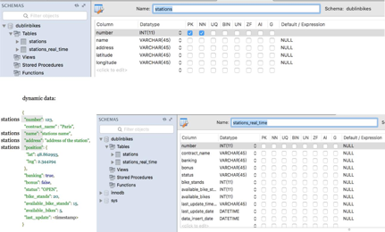
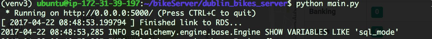

# dublinbike
 AWS/Python/Linux/MySQL/Google map API/Google chart/Open weather API/JSON/flask/jinja2/Bootstrapt/JQuery

 Created a web applications to display occupancy and weather information for Dublinbike. Using Scrum management.
meeting notes in here https://trello.com/b/KAaZIGR8/dublinbikeproject 

  1. data collection through API
  2. data manaement/stored in DB on AWS
  
  
  3. display bike stations on map
  4. weather information
  5. occupancy information
  
  
  6. project run on EC2
  
  
  
  

